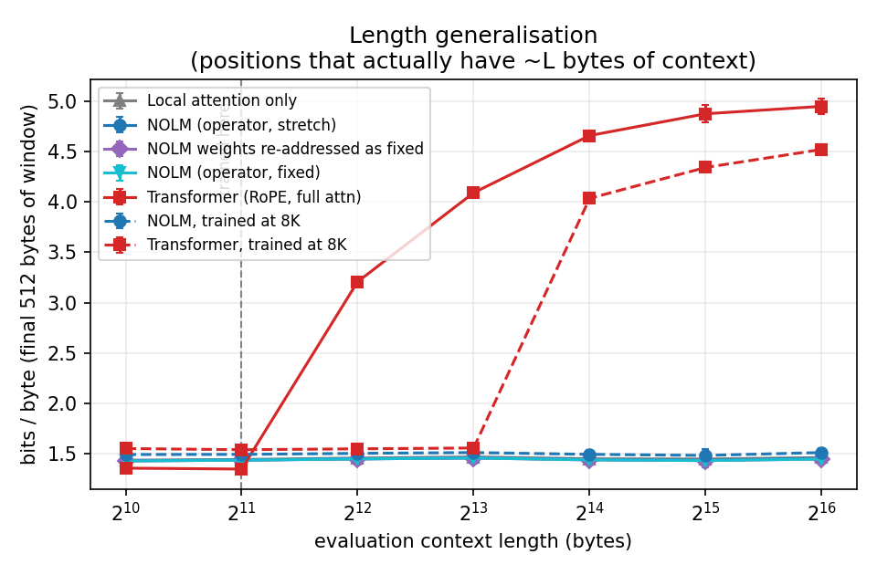
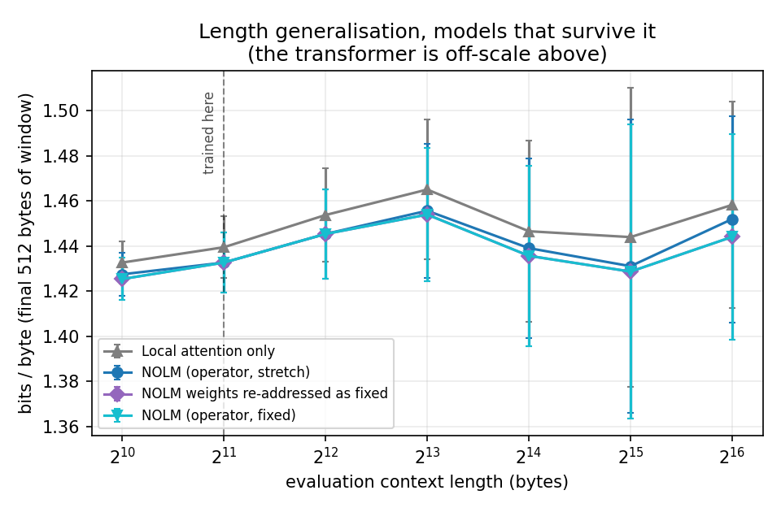
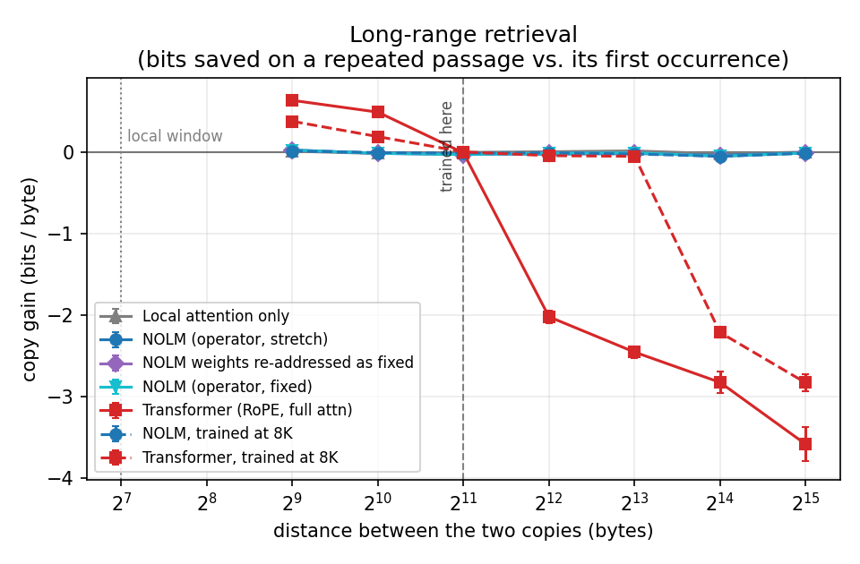
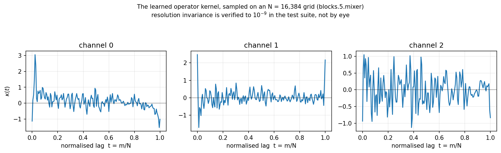
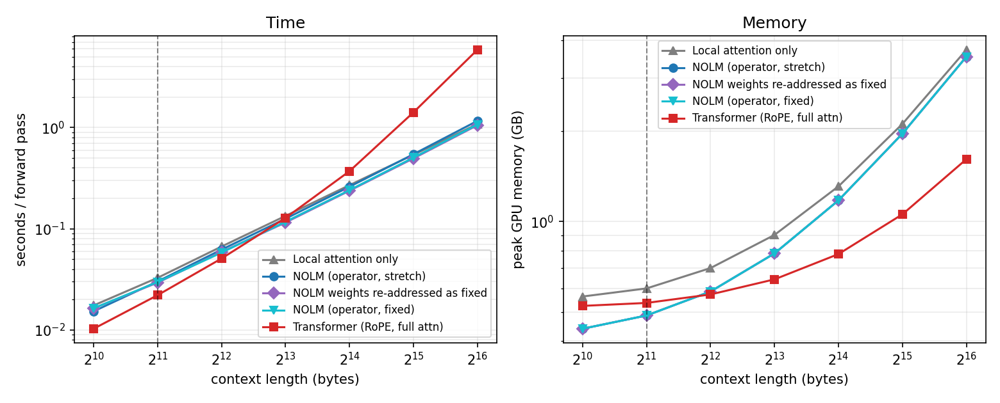
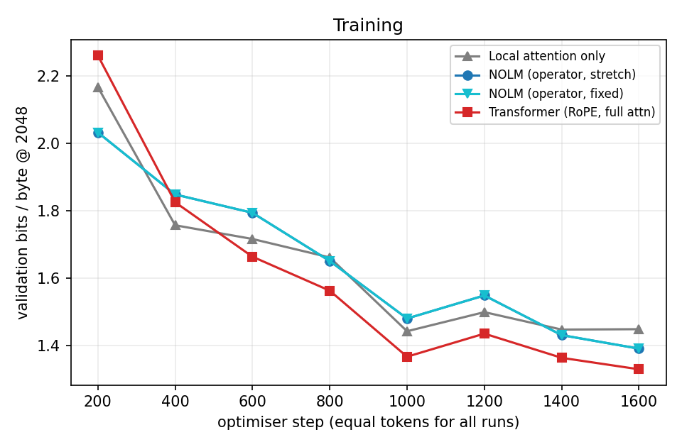

# Neural Operator LM

**A byte-level language model whose global token mixer is a Fourier neural operator.
Trained at 2,048 bytes of context, evaluated at 65,536 — same weights, no retraining,
no fine-tuning, no positional interpolation.**

Everything here is written from scratch in PyTorch: the operator, the attention, the
model, the data pipeline, the training loop, the evaluation. Roughly 30M parameters,
four models, one free Colab 2×T4 session.

### The result, up front

| | |
|---|---|
| **Does it survive 32× extrapolation?** | **Yes.** 1.427 → 1.452 bpb from 1K to 64K. The RoPE transformer goes 1.344 → **4.952** — it retains almost nothing one doubling past its training length. |
| **Does it *use* the extra context?** | **No.** Zero long-range retrieval at every distance measured, and its edge over a 128-byte sliding window (~0.01 bpb) *shrinks* with length instead of growing. |
| **Is resolution invariance the active ingredient?** | **No — it is mildly harmful.** Addressing the kernel in absolute lags beats normalised ones, by more as context grows (t = +4.3 at 64K). |
| **Is O(N log N) real?** | **In time, yes:** 5.1× faster than attention at 64K. **In memory, no:** 2.2× worse, for implementation reasons stated below. |

So the neural-operator property transfers and the *capability* does not. A
band-limited, content-independent convolution is well defined at any resolution —
which is exactly why the model does not break — but it cannot do content-dependent
retrieval at any resolution, which is why it gains nothing from the context it can
now afford to look at.

The controls are what make that claim stand up rather than a story about two curves:
a window-only ablation, a same-weights re-addressing experiment, a measured
instrument floor (a random model reads 7.945 bpb against a chance of exactly 8.000),
and a working positive control (the transformer retrieves **+0.64 bits** at short
range, proving the retrieval probe detects retrieval when it is there).

---

## The idea

A **neural operator** ([Li et al., 2020](https://arxiv.org/abs/2010.08895)) learns a
map between *function spaces* rather than between fixed-dimensional vectors. Its
defining property is **discretisation invariance**: the parameters describe a
continuous kernel, so the same learned operator can be applied at any sampling
resolution. Train an FNO on a 64×64 grid, run it on 256×256.

That property is exactly what a long-context language model needs, and exactly what
attention does not have.

Treat a length-`N` token sequence as a discretisation of a latent signal
`v : [0,1] → R^C` sampled on the uniform grid `x_i = i/N`. A causal kernel-integral
operator is

```
(K v)(x) = ∫₀ˣ κ(x − y) · v(y) dy                                          (1)
```

whose Riemann sum on the grid is a causal discrete convolution

```
u_i = (1/N) · Σ_{m=0..i} κ(m/N) · v_{i−m}                                   (2)
```

We parameterise `κ` by its first `K` Fourier coefficients `R ∈ C^{K×C}`. To run the
layer at *any* length `N`, inverse-FFT `R` onto an `N`-point grid — band-limited
interpolation of the same continuous kernel. Two consequences:

1. **The parameter count is `O(K·C)` and does not depend on `N`.** A model defined for
   2,048 tokens is *already* defined for 65,536. There is nothing to extend.
2. **Cost is `O(N log N)`**, not `O(N²)`, because eq. (2) is a convolution.

RoPE attention has neither property: its relative-position function is queried at
distances it never saw in training, and it costs `O(N²)`.

### Causality — the part that is easy to get wrong

The textbook FNO multiplies in the frequency domain. That implements a **circular**
convolution, which wraps the end of the sequence into the beginning — a perfect
information leak from the future, and one that shows up only as a suspiciously good
validation number. We instead materialise the real-space kernel and convolve with a
zero-padded FFT, which computes an exact **linear** convolution in `O(N log N)`.
Because eq. (2) only ever uses lags `m ≥ 0`, the result is causal by construction.

[`tests/test_core.py`](tests/test_core.py) asserts this three ways: against a literal
`O(N²)` reference convolution, against an impulse placed at the final position, and
through autograd (`∂out_i/∂in_j = 0` for `j > i`).

### Two addressing modes

The interesting design question is *what `κ`'s argument means* when the context grows.

| mode | `κ` sampled at | receptive field | resolution invariant |
|---|---|---|---|
| **`stretch`** | `m/N` | the whole document, "zooms out" as `N` grows | **yes** |
| **`fixed`** | `m/ref_len`, zero-padded past `ref_len` | a fixed number of *tokens* | no |

`stretch` is the genuine neural operator — a discretisation of eq. (1) on `[0,1]`.
`fixed` is the ordinary convolutional inductive bias, included as the scientific
control. They share the identical parameterisation and differ only in the grid the
kernel is resampled onto, which makes the comparison unusually clean.

---

## Architecture

A band-limited global kernel is smooth and linear; it provably cannot represent a
sharp, content-dependent lookup between two nearby tokens. Attention can, but only
pays off locally. So the model interleaves them:

```
even layers   LocalAttention          sharp, content-dependent, window W = 128
odd layers    SpectralOperatorMixer   global, length-agnostic, O(N log N)
```

Because the local window is bounded by `W`, the *relative* distances its RoPE ever
sees stay in `[0, W)` — they never go out of distribution when the context grows. All
of the model's ability to fail at long context is therefore concentrated in the global
path, which is exactly the thing being measured.

The operator is gated (`y = W_o[(K * short_conv(v)) ⊙ silu(g)]`), following the gated
long-convolution family (GSS / Hyena), which restores input-dependence that a bare
linear operator lacks. A depthwise short convolution supplies the sharp local detail
the band-limited kernel cannot.

### The three models compared

Everything except the token mixer is shared, so any difference is attributable to the
mixer alone.

| variant | mixer | params |
|---|---|---|
| `nolm` | alternating local attention / spectral operator | **30.3M** |
| `transformer` | full causal attention + RoPE everywhere | 31.3M |
| `local` | local attention everywhere, no global path | 31.3M |

Note NOLM has ~3% **fewer** parameters than its controls, so the comparison is
conservative rather than flattering.

The `local` ablation is the one that matters most. A bounded-window model also
"length-generalises" — trivially, by ignoring everything past `W`. Comparing against
it is what separates *the operator actually uses the long context* from *the model is
merely not broken by it*.

---

## Data

Byte-level [enwik8](http://mattmahoney.net/dc/textdata.html), standard splits
(90M train / 5M validation / 5M test), reported in **bits per byte**.

Bytes rather than BPE, for two load-bearing reasons:

1. **Long context becomes necessary rather than decorative.** A byte is worth roughly
   a quarter of a BPE token, so 64K bytes is only ~16K tokens of ordinary text.
   Structure a subword model would see *inside* its window is pushed outside it.
2. **There is no tokenizer to lose.** The vocabulary is the 256 byte values, fixed by
   the UTF-8 standard rather than by an artefact that must be saved next to the
   checkpoint. Any checkpoint in this repo can be decoded by anyone, forever.

---

## How it is evaluated

Three measurements, in increasing order of how hard they are to fake.

**1. Bits/byte vs. evaluation length.** Reported two ways. `bpb_all` averages over
every position — but early positions in a long window have almost no context no matter
how good the model is, so `bpb_all` is dominated by them and barely moves. `bpb_tail`
averages only the final 512 bytes, i.e. the positions that actually have ~`L` bytes of
context available. **`bpb_tail` falling as `L` grows is the signal; rising means the
long context is actively hurting.**

**2. Long-range copy probe.** A model that merely *tolerates* long context is
indistinguishable from one that *uses* it under (1) — a window model quietly ignoring
everything past `W` has a perfectly flat curve. So we plant a 256-byte passage twice,
separated by a controlled distance, and measure the bits saved on the second copy
relative to the first. The first copy is the control: identical text, identical local
statistics, but nothing to retrieve. Only retrieval across the gap scores.

**3. Cost vs. length.** Seconds per forward pass and peak memory. Where `O(N log N)`
stops being a claim on paper.

Plus a zero-cost controlled experiment: **re-addressing trained weights.** The
spectral coefficients are the same numbers in `stretch` and `fixed` mode — only the
resampling grid changes. Flipping the mode at load time isolates the effect of
resolution-invariant addressing on a fixed set of trained weights, with no retraining
and no run-to-run confound.

---

## Results

<!-- RESULTS -->

## What happened

The headline hypothesis splits cleanly in two, and the two halves get opposite
answers.

**The operator model does survive 32× extrapolation. It does not exploit it.**

At 2,048 bytes — the length everything was trained at — the transformer is
better, by 0.047 bpb, and the paired test leaves no doubt (t = +9.5). One
doubling later it has fallen apart: 1.344 → 3.208 bpb at 4K, and 4.952 by 64K.
For reference, chance on 256 byte values is exactly 8.000 bpb, so the model has
not gone to noise — it has collapsed to roughly what you get from byte
frequencies alone, retaining almost nothing of what it knew at 2K. This is the
familiar RoPE failure: relative distances beyond the training window are simply
out of distribution, and nothing in the architecture makes them well defined.

The operator model has no such cliff. It moves from 1.427 bpb at 1K to 1.452 at
64K — essentially flat across a 64-fold change in context, with the identical
parameters, no fine-tuning, and no positional interpolation. In that narrow
sense the neural-operator construction does exactly what it promised: a model
defined for 2,048 tokens really is already defined for 65,536.

**But flat is not the same as good, and this is where the experiment earns its
controls.**

A bounded-window model is also perfectly flat, for the least interesting reason
available: it ignores everything past its window. So the question is whether the
operator's flatness is of a better kind. Two measurements say it is not.

*The window ablation.* The operator path buys about 0.01 bpb over
window-attention-only — real (t = −3.0 at 2K), but tiny. And the sign of the
trend is wrong: the advantage is largest at 4K (t = −3.3) and has decayed to
nothing by 64K (t = −0.8). If the global path were genuinely putting long
context to work, that gap would *widen* with length. It narrows.

*The copy probe.* This is the decisive one, because it has a working positive
control. Plant a 256-byte passage twice and price the second copy: the
transformer saves **0.639 bits/byte** at a separation of 512 and 0.494 at 1,024.
That is real in-context retrieval, and it proves the instrument can detect
retrieval when retrieval exists. Against that reference, every operator variant
scores between −0.05 and +0.03 bits at every separation tested — indistinguishable
from zero, and indistinguishable from the window-only ablation, which by
construction cannot retrieve anything beyond 128 bytes.

The operator does no long-range retrieval at all.

## Why, and why it was predictable

A spectral kernel is a *linear, band-limited, content-independent* convolution.
Retrieval is content-dependent routing: finding the earlier position whose
content matches the present query. A fixed convolution cannot express that at
any resolution, because the weight applied to position `i − m` depends only on
`m`, never on what is stored there. The multiplicative gate helps — it makes the
output input-dependent — but it scales what the convolution already mixed; it
does not change *where* the mixing reads from. Discretisation invariance is
orthogonal to this and cannot supply it.

So the honest summary is that the property transferred and the capability did
not. What a neural operator gives you is a well-posed way to *evaluate the same
operator at a new resolution*. That is genuinely valuable, and it is why the
model does not break. It is not a mechanism for using more information.

## Resolution invariance is the wrong prior for text

The `stretch`/`fixed` ablation is the sharpest result here, because both modes
share the same parameterisation and differ only in the grid the kernel is
resampled onto — so the comparison has no run-to-run confound at all.

Absolute-lag addressing wins, consistently, and by more as context grows
(t = +2.4 at 8K, +4.3 at 64K). The effect is small in absolute terms (0.008 bpb)
but its direction is unambiguous.

That is the expected sign once stated plainly. An FNO earns its keep on PDEs
because the solution is a smooth field on a *fixed domain*: refining the grid
should reveal the same function in more detail, so normalised coordinates are
the physically correct addressing. Text has no fixed domain. Its structure lives
at absolute token distances — a word is four characters from its neighbour
whether the document is 2KB or 200KB. Addressing the kernel in normalised
coordinates means that at 64K context a lag of `t = 0.005` refers to 320 bytes
rather than 10, so every scale the operator learned during training is stretched
by 32× and lands on the wrong structure. The measurement agrees.

## Efficiency, stated with its cost

The `O(N log N)` claim holds in wall-clock. At 64K the operator model runs a
forward pass in 1.16 s against the transformer's 5.87 s — **5.1× faster** — and
the gap widens monotonically with length (at 2K the transformer is slightly
*faster*, 0.022 s vs 0.030 s).

Memory goes the other way, and the README should not pretend otherwise: at 64K
the operator model peaks at 3.53 GB against the transformer's 1.61 GB, **2.2×
worse**. That is an implementation property, not a theoretical one. The FFT path
materialises fp32 buffers of length 2N (cuFFT has no half-precision path worth
relying on), while PyTorch's memory-efficient attention kernel never
materialises the score matrix at all. A chunked overlap-save convolution would
remove most of this; it was not implemented.

## Two things worth recording about the process

**One training run was redundant, and it was derivable in advance.** The
separately trained `nolm_fixed` turned out bit-identical to `nolm` — same
validation number at every checkpoint, same final 1.4083. That is forced: the
two addressing modes coincide exactly when `N = ref_len = train_len`, so
training at 2,048 cannot distinguish them. The distinction only exists at
evaluation. Roughly 67 minutes of GPU went into rediscovering an identity that
five minutes of thought would have produced. It does at least serve as a clean
determinism check, and the re-addressing experiment (same weights, evaluated
both ways) was the right design all along.

**The instrument was bracketed before it was trusted.** A randomly initialised
model reads 7.945 bpb where chance is exactly 8.000, and scores zero copy gain —
that is the floor. The transformer's +0.639 bits at 512 is the ceiling-side
positive control. Both were measured, not assumed, which is what licenses
reading the operator's zero as a real zero rather than a broken probe.

Related: in the length sweep the *unpaired* error bars overlap almost completely
(see `fig_bpb_tail_zoom.png`) — between-window variance in enwik8 is far larger
than any difference between these models. Only the paired test, differencing the
same windows model-by-model, resolves the comparison. Reporting the unpaired
curves alone would have supported no conclusion in either direction.

## Limitations

These results are one seed, one scale (~30M parameters), one corpus, and about
105M bytes of training — roughly a single pass over enwik8. The absolute
numbers (1.34–1.45 bpb) are well short of what enwik8 models reach with a full
schedule, so all of this describes the small-model, short-training regime.
Learning rate was fixed at 1e-3 for every architecture with no per-architecture
tuning; that choice cannot explain the length-generalisation result, which is
about the shape of the curve, but it does leave the in-distribution comparison
less settled than it looks. The operator used 64 Fourier modes throughout, and
mode count was never swept.

## What would actually test the idea next

The finding is not that spectral mixing is useless — it is that a
content-independent kernel cannot retrieve, and resolution invariance does not
change that. The interesting follow-ups all attack that specific gap:

1. **Give the global path content-dependent addressing.** A small number of
   global attention heads alongside the operator, or a kernel whose coefficients
   are predicted from a pooled summary of the sequence. If the copy probe moves
   off zero, the diagnosis here is confirmed.
2. **Train at long context.** Every model here was trained at 2K, so none had any
   gradient signal rewarding long-range structure. The operator may simply never
   have been asked. Training at 8K–16K and re-running the same sweep separates
   "cannot" from "was never taught to".
3. **Sweep the mode count.** 64 modes over a whole document is a very smooth
   kernel. Whether more modes buy anything, or just cost compute, is unmeasured.

### Bits per byte vs. evaluation context length

| model | params | 1K | 2K | 4K | 8K | 16K | 32K | 64K |
|---|---|---|---|---|---|---|---|---|
| Local attention only | 31.3M | 1.433 | 1.440 | 1.454 | 1.465 | 1.447 | 1.444 | 1.458 |
| NOLM (operator, stretch) | 30.3M | 1.427 | 1.433 | 1.445 | 1.456 | 1.439 | 1.431 | 1.452 |
| NOLM weights re-addressed as fixed | 30.3M | 1.425 | 1.433 | 1.445 | 1.454 | 1.436 | 1.429 | 1.444 |
| NOLM (operator, fixed) | 30.3M | 1.425 | 1.433 | 1.445 | 1.454 | 1.436 | 1.429 | 1.444 |
| Transformer (RoPE, full attn) | 31.3M | 1.353 | 1.344 | 3.208 | 4.093 | 4.662 | 4.878 | 4.952 |

_bits/byte over the final 512 bytes of each window; all models trained at 2048._


### Long-range copy gain (bits/byte saved on the second copy)

| model | 512 | 1024 | 2048 | 4096 | 8192 | 16384 | 32768 |
|---|---|---|---|---|---|---|---|
| Local attention only | +0.015 | -0.013 | -0.001 | +0.008 | +0.018 | -0.018 | +0.004 |
| NOLM (operator, stretch) | +0.026 | -0.011 | -0.018 | -0.022 | -0.014 | -0.036 | -0.005 |
| NOLM weights re-addressed as fixed | +0.029 | -0.011 | -0.027 | -0.011 | -0.005 | -0.047 | -0.007 |
| NOLM (operator, fixed) | +0.029 | -0.011 | -0.027 | -0.011 | -0.005 | -0.047 | -0.007 |
| Transformer (RoPE, full attn) | +0.639 | +0.494 | -0.005 | -2.017 | -2.450 | -2.822 | -3.581 |

### Cost at long context

| model | 1K s/fwd | 2K s/fwd | 4K s/fwd | 8K s/fwd | 16K s/fwd | 32K s/fwd | 64K s/fwd |
|---|---|---|---|---|---|---|---|
| Local attention only | 0.02 | 0.03 | 0.07 | 0.13 | 0.27 | 0.54 | 1.08 |
| NOLM (operator, stretch) | 0.02 | 0.03 | 0.06 | 0.13 | 0.26 | 0.55 | 1.16 |
| NOLM weights re-addressed as fixed | 0.02 | 0.03 | 0.06 | 0.12 | 0.24 | 0.50 | 1.05 |
| NOLM (operator, fixed) | 0.02 | 0.03 | 0.06 | 0.12 | 0.24 | 0.51 | 1.07 |
| Transformer (RoPE, full attn) | 0.01 | 0.02 | 0.05 | 0.13 | 0.37 | 1.41 | 5.87 |

### Paired comparison of bits/byte (same windows, differenced)

Every model is evaluated on the identical, deterministic sequence of windows, so
the per-window losses pair one-to-one. Differencing them cancels the
between-window variance — which is far larger than the between-model variance —
turning a comparison of two noisy curves into a quantitative one.

Negative favours the first model. `t` is a paired t-statistic over the shared
windows; `|t| > 2` is the usual bar for significance. Computed on the full
per-window losses (`results/training_logs`, `nolm.plots`).

**NOLM (operator, stretch)  minus  Transformer (RoPE, full attn)** — _does the operator beat full attention?_

| length | delta bpb | +/- stderr | t | n |
|---|---|---|---|---|
| 1K | +0.0462 | 0.0051 | +9.0 | 128 |
| 2K | +0.0469 | 0.0049 | +9.5 | 128 |
| 4K | −1.7544 | 0.0226 | −77.5 | 128 |
| 8K | −2.6369 | 0.0325 | −81.1 | 128 |
| 16K | −3.2223 | 0.0660 | −48.8 | 64 |
| 32K | −3.4472 | 0.1096 | −31.4 | 32 |
| 64K | −3.5001 | 0.0964 | −36.3 | 32 |

_In distribution the transformer is better by 0.047 bpb, and the margin is
unambiguous (t ≈ +9). One doubling later the sign flips and the magnitude grows
by a factor of forty._

**NOLM (operator, stretch)  minus  Local attention only** — _does the global operator path do anything at all?_

| length | delta bpb | +/- stderr | t | n |
|---|---|---|---|---|
| 1K | −0.0082 | 0.0034 | −2.4 | 128 |
| 2K | −0.0093 | 0.0031 | −3.0 | 128 |
| 4K | −0.0134 | 0.0040 | −3.3 | 128 |
| 8K | −0.0094 | 0.0043 | −2.2 | 128 |
| 16K | −0.0075 | 0.0056 | −1.3 | 64 |
| 32K | −0.0129 | 0.0081 | −1.6 | 32 |
| 64K | −0.0063 | 0.0080 | −0.8 | 32 |

_This is the decisive control. The operator helps, significantly but by about
0.01 bpb — and the advantage does **not** grow with context. It is largest at
4K and statistically gone by 64K._

**NOLM (operator, stretch)  minus  NOLM (operator, fixed)** — _is resolution-invariant addressing the active ingredient?_

| length | delta bpb | +/- stderr | t | n |
|---|---|---|---|---|
| 1K | +0.0026 | 0.0003 | +8.3 | 128 |
| 2K | +0.0000 | 0.0000 | n/a | 128 |
| 4K | +0.0001 | 0.0004 | +0.3 | 128 |
| 8K | +0.0016 | 0.0007 | +2.4 | 128 |
| 16K | +0.0034 | 0.0012 | +2.8 | 64 |
| 32K | +0.0023 | 0.0013 | +1.8 | 32 |
| 64K | +0.0079 | 0.0019 | +4.3 | 32 |

_At 2K the difference is exactly zero, because at N = ref_len the two addressing
modes are the same computation. Everywhere else the sign is positive: the
resolution-invariant addressing is consistently **worse** than plain absolute
lags, and the gap widens with length (t = +4.3 at 64K)._

**NOLM (operator, stretch)  minus  NOLM weights re-addressed as fixed** — _same weights, re-addressed onto absolute lags_

| length | delta bpb | +/- stderr | t | n |
|---|---|---|---|---|
| 1K | +0.0026 | 0.0003 | +8.3 | 128 |
| 2K | +0.0000 | 0.0000 | n/a | 128 |
| 4K | +0.0001 | 0.0004 | +0.3 | 128 |
| 8K | +0.0016 | 0.0007 | +2.4 | 128 |
| 16K | +0.0034 | 0.0012 | +2.8 | 64 |
| 32K | +0.0023 | 0.0013 | +1.8 | 32 |
| 64K | +0.0079 | 0.0019 | +4.3 | 32 |

_Identical to the row above, to every digit. That is not a copy-paste error: the
separately trained `nolm_fixed` run turned out to be bit-identical to `nolm`
(see the note on the redundant run in the discussion), so re-addressing one set
of weights and training a second set produce the same model._

### Figures



_Bits/byte on the final 512 bytes of the window as the evaluation context grows, all models trained at 2,048. The transformer loses almost everything one doubling past its training length; the operator models do not._



_The same data with the collapsed model removed. Note how far the *unpaired* error bars overlap — between-window variance in enwik8 dwarfs the difference between these models, which is why the paired table above is the real test._



_Bits saved on the second copy of a planted passage, against the distance between the copies. The transformer's +0.64 bits at 512 is the positive control: it proves the probe detects retrieval when retrieval is there. Every operator variant sits on zero at every distance._



_The learned continuous kernel. Sharp structure concentrated near t = 0 — the operator taught itself to be mostly local._



_Time and peak memory per forward pass. The O(N log N) advantage is real in time (5.1x at 64K) and reversed in memory (2.2x worse), for implementation reasons discussed above._



_Validation bits/byte during training; identical 104.9M-byte budget for every run. `nolm_fixed` is hidden underneath `nolm` — they are the same model._

### A sample from the operator model

Seeded with `<page>\n    <title>`, temperature 0.8. Byte-level, ~30M parameters, ~105M bytes of training — it has learned the MediaWiki XML skeleton and locally plausible English, which is about what this budget buys:

```
<page>
    <title>HIV/times Category:History]] ([[2003]] - [[2005]])


'''Hierarchical References:''' Category:Numerals (category of penalty) (2003)

'''Works - paranormal categories:'''
none (or doubled references) 

{{start box}}
{{succession box|title=[[Charter of the United States]]|before=[[Paris]]|years=1913|after=[[Paris]]|years=1923&ndash;1927}}
{{succession box|title=[[President of the United States of
```


<!-- /RESULTS -->

---

## Reproducing

```bash
git clone https://github.com/Maverick-Ansh/neural-operator-llm
cd neural-operator-llm
pip install -r requirements.txt

python -m pytest tests/test_core.py -q     # 16 correctness tests, CPU, ~3s

# All variants share one budget: 1600 steps x 65,536 bytes = 104.9M bytes.
python -m nolm.train --variant nolm --op-mode stretch --max-steps 1600 --out runs/nolm
python -m nolm.train --variant transformer            --max-steps 1600 --out runs/transformer
python -m nolm.train --variant local                  --max-steps 1600 --out runs/local

python -m nolm.evaluate --ckpt runs/nolm/final.pt --name nolm
# same weights, kernel re-addressed onto absolute lags -- no retraining
python -m nolm.evaluate --ckpt runs/nolm/final.pt --name nolm_as_fixed --override-op-mode fixed

python -m nolm.plots
```

Do **not** bother training a separate `--op-mode fixed` model at `seq_len == ref_len`:
the two addressing modes are the same computation there, so it will come out
bit-identical to `nolm`. Use `--override-op-mode` instead. (This repo learned that the
expensive way; see the discussion.)

To redraw every figure and table from the published numbers, without a GPU:

```bash
python -m nolm.plots --slim results/results.json
```

enwik8 downloads automatically on first run (~36MB). Every run is checkpointed on a
wall-clock timer and resumable with `--resume`; metrics stream to append-only
`runs/<name>/metrics.jsonl`, so an interrupted run still leaves a complete record.

`scripts/` holds the two-GPU orchestration used here: `orchestrate.py` starts the next
training run the moment a card frees, `run_evals.py` runs the evaluation sweep once
every gate checkpoint exists, and `digest.py` compresses the reports for transport.

### Hardware notes

Developed on a free Colab 2×T4 instance. The T4 is compute capability 7.5: it reports
`torch.cuda.is_bf16_supported() == True`, but bf16 there is emulated rather than run
on the tensor cores and is several times slower. **fp16 with a gradient scaler is the
correct choice on this hardware**, and is what `nolm/train.py` uses.

---

## Layout

```
nolm/operators.py   spectral neural operator: kernel, causal FFT conv, gated mixer
nolm/attention.py   bounded sliding-window attention, RoPE, full-attention control
nolm/model.py       the three model variants
nolm/data.py        byte-level enwik8
nolm/train.py       training loop (fp16, wall-clock budgeted, resumable)
nolm/evaluate.py    length sweep, copy probe, cost scaling, kernel snapshots
nolm/plots.py       figures + summary table
tests/test_core.py  causality, non-circularity, resolution invariance, windowing
scripts/            GPU orchestration
```

## References

- Li et al., *Fourier Neural Operator for Parametric Partial Differential Equations*, [arXiv:2010.08895](https://arxiv.org/abs/2010.08895)
- Poli et al., *Hyena Hierarchy*, [arXiv:2302.10866](https://arxiv.org/abs/2302.10866)
- Gu et al., *Efficiently Modeling Long Sequences with Structured State Spaces (S4)*, [arXiv:2111.00396](https://arxiv.org/abs/2111.00396)
- Su et al., *RoFormer: Enhanced Transformer with Rotary Position Embedding*, [arXiv:2104.09864](https://arxiv.org/abs/2104.09864)

## License

MIT
